<!-- Uses MARP, see https://marp.app/ -->

<!--
class:
 - lead
 - invert
-->

# DORA metrics in Eiffel

####

#### Erik Sternerson, doWhile / Volvo Cars

<!-- Notes
-->

---
<!--
_class:
 - invert
-->

# In this talk

* ## The DORA metrics
* ## DORA metrics through Eiffel events

--- 

<!-- >>> Erik <<<

-->

--- 
# The DORA metrics

<!-- >>> Erik <<<

-->

---

# Deployment Frequency

<!-- Notes
-->

---

# Deployment Frequency

### How often does your organization **deploy code to production** or **release it to end users**? 

<!-- For the primary application or service you work on, how often does your organization deploy code to production or release it to end users?
-->

---

# Lead Time for Changes

<!-- Notes
-->

---

# Lead Time for Changes

### How long does it take to **go from code committed** to code successfully **running in production**? 

<!-- For the primary application or service you work on, what is your lead time for changes (that is, how long does it take to go from code committed to code successfully running in production)? 
-->

---

# Change Failure Rate

<!-- Notes
-->

---

# Change Failure Rate

### What **percentage of changes** to production or releases to users result in **degraded service** and subsequently require **remediation**? 

<!-- For the primary application or service you work on, what percentage of changes to production or releases to users result in degraded service (for example, lead to service impairment or service outage) and subsequently require remediation (for example, require a hotfix, rollback, fix forward, patch)? 
-->

---

# Time to Restore

<!-- Notes
-->

---

# Time to Restore

### How long does it generally take to **restore service** when a service incident or a defect that **impacts users** occurs?

<!-- For the primary application or service you work on, how long does it generally take to restore service when a service incident or a defect that impacts users occurs (for example, unplanned outage, service impairment)? 
-->

---

<!--
_class:
 - invert
-->

# DORA Metrics

- ## Deployment Frequency
- ## Lead Time for Changes
- ## Change Failure Rate
- ## Time to Restore

---

# Metrics through Eiffel

<!-- Notes
-->

---

# Deployment Frequency

---

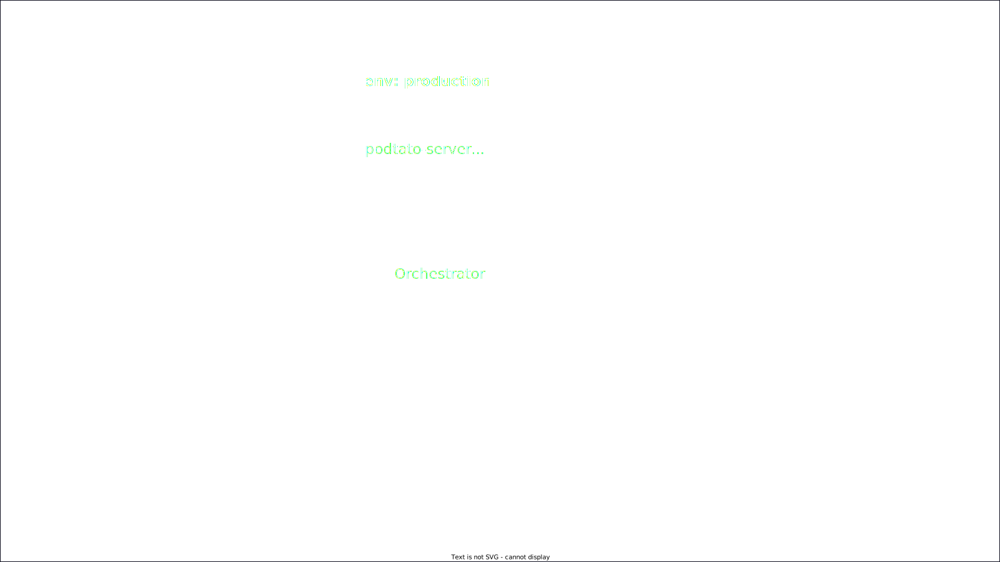

---

---

---

---

---

# Lead Time for Changes

---

---

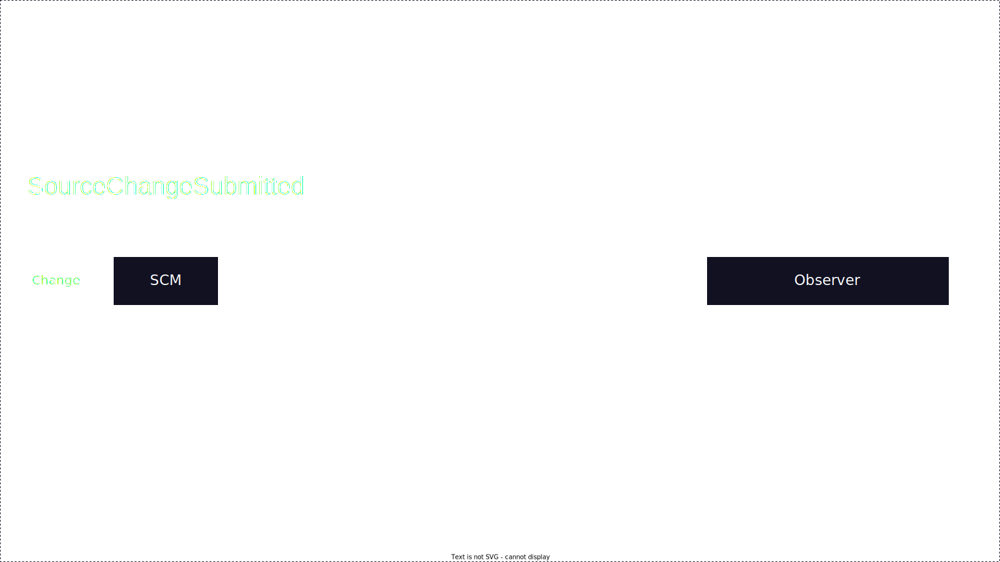

---

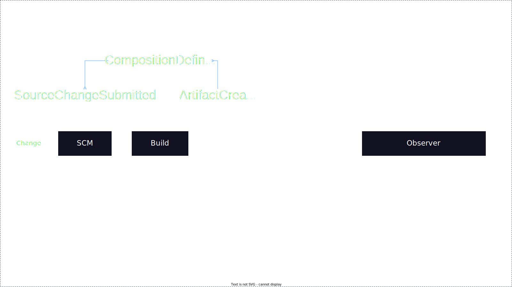

---

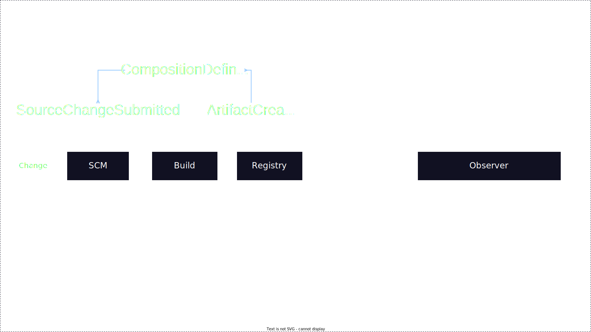

---

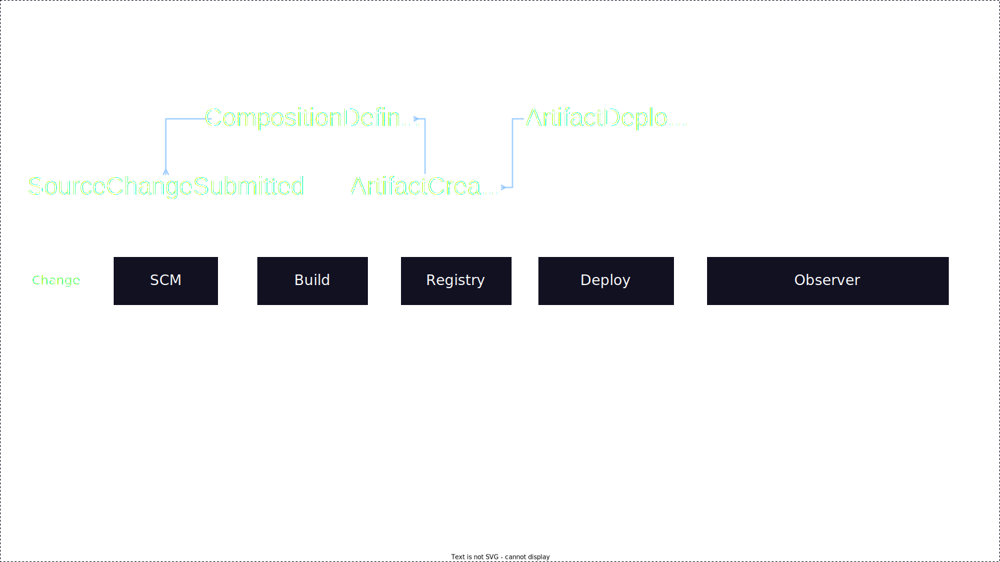

---

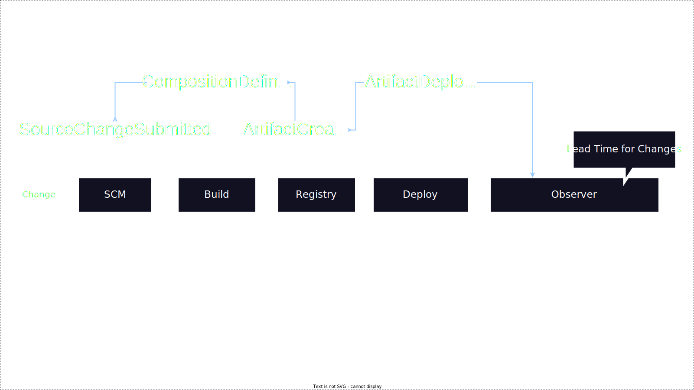

---

# Change Failure Rate

---

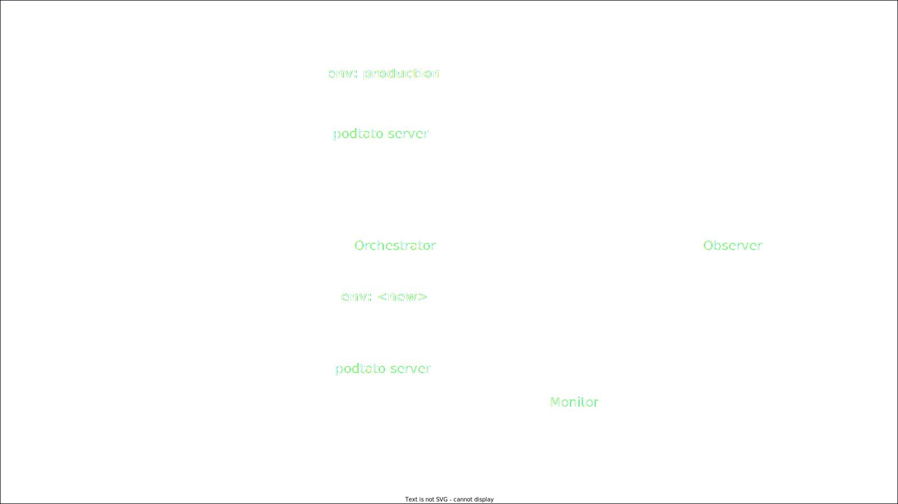

---

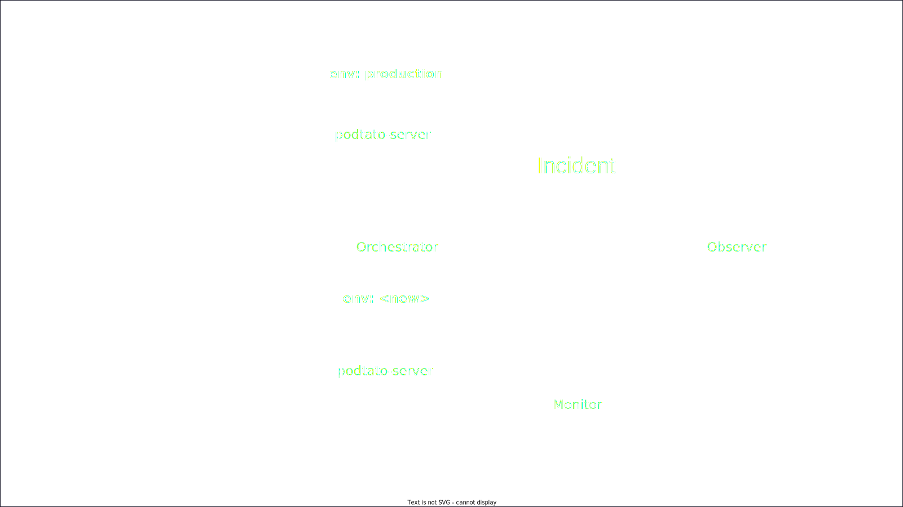

---

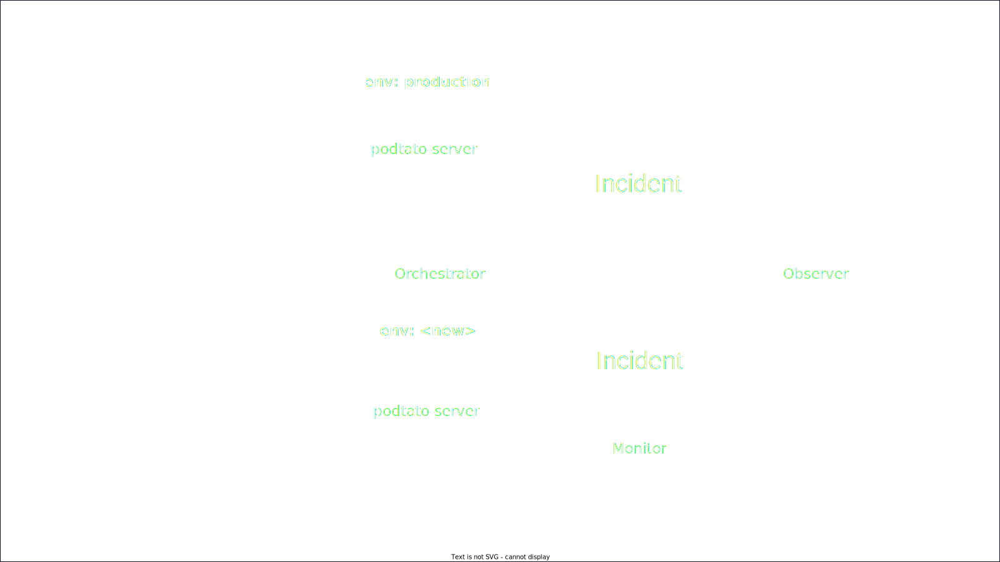

---

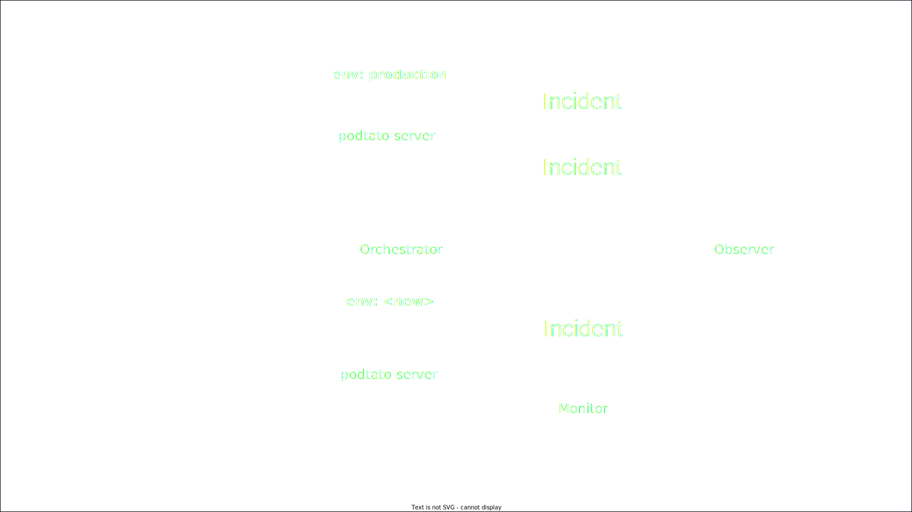

---

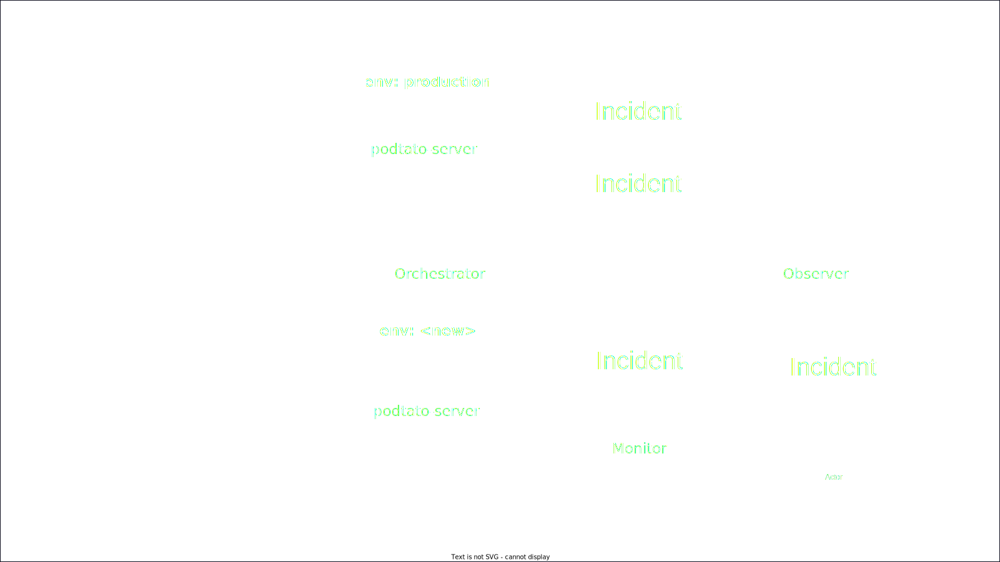

---

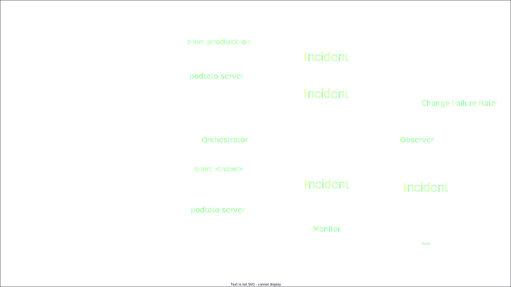

---

# No dedicated incident event

# Suggestion: AnnouncementPublished

---

# Time to Restore

---

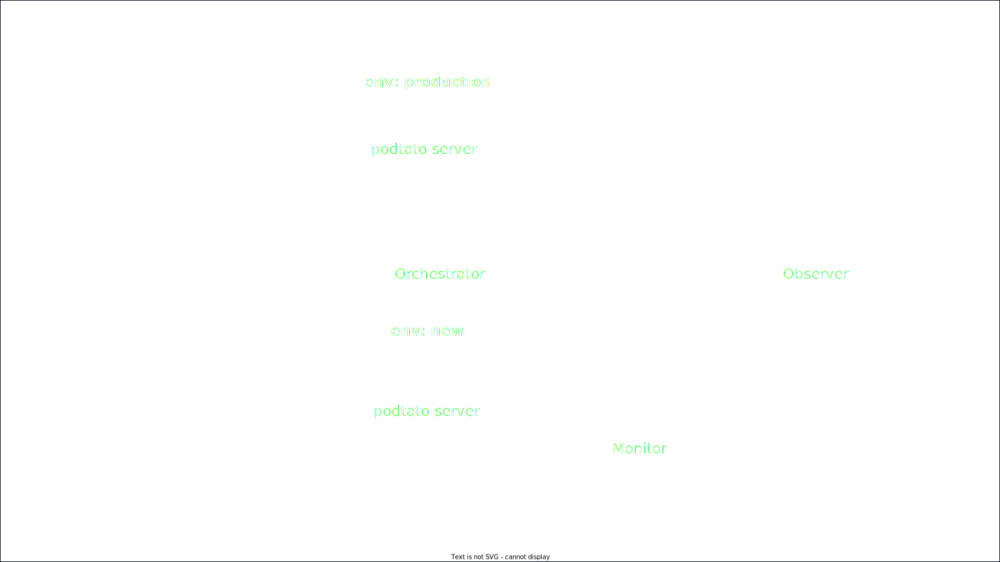

---

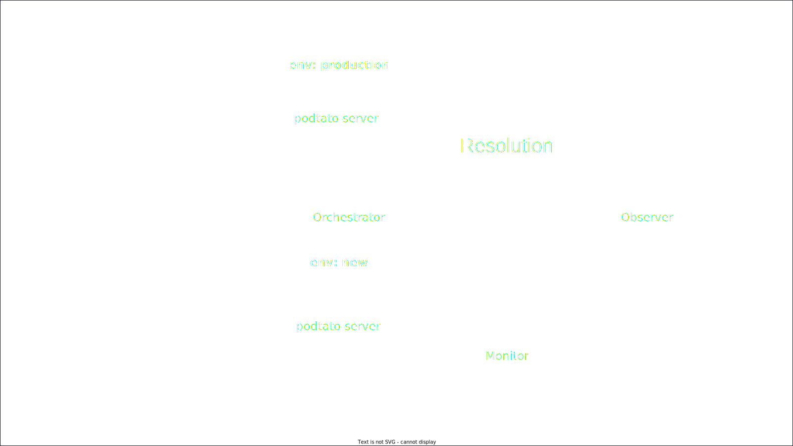

---

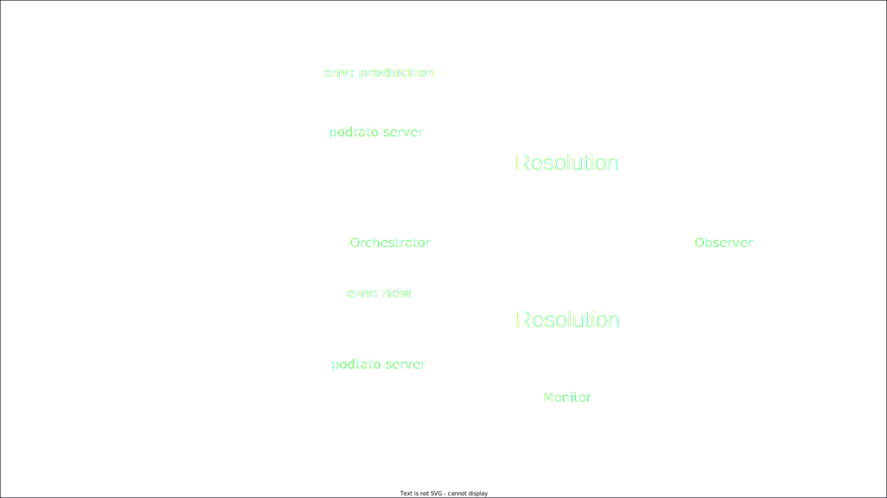

---

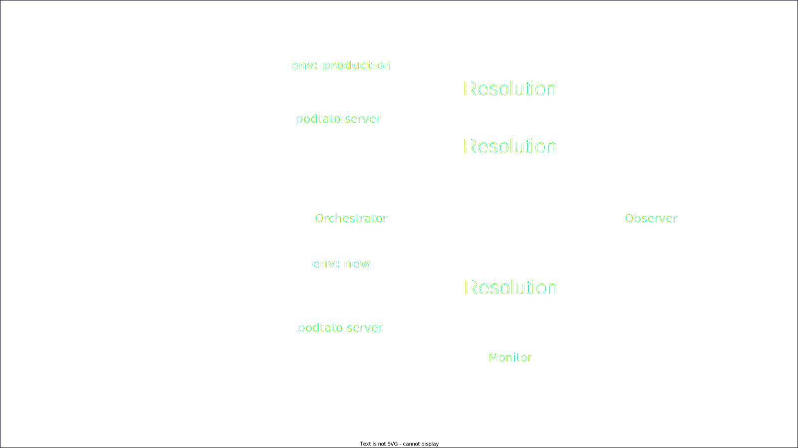

---

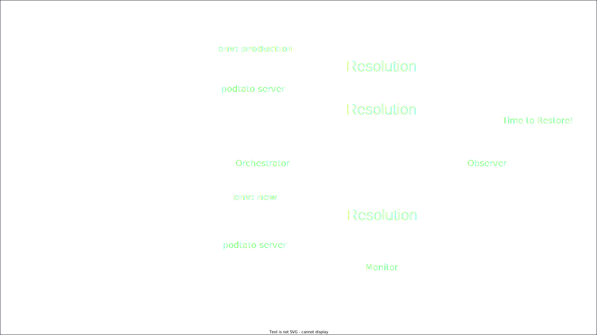

---

# No dedicated resolution event

# Suggestion: AnnouncementPublished

---

<!--
_class:
 - invert
-->

# DORA Metrics

- ## Deployment Frequency
- ## Lead Time for Changes
- ## Change Failure Rate
- ## Time to Restore

---
# Thank you!
# Q&A

<!-- ...
-->