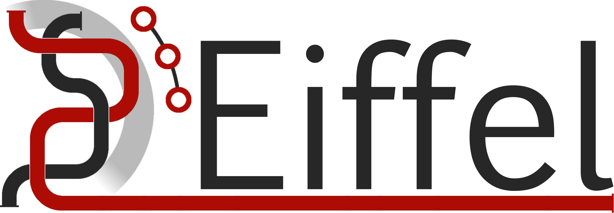
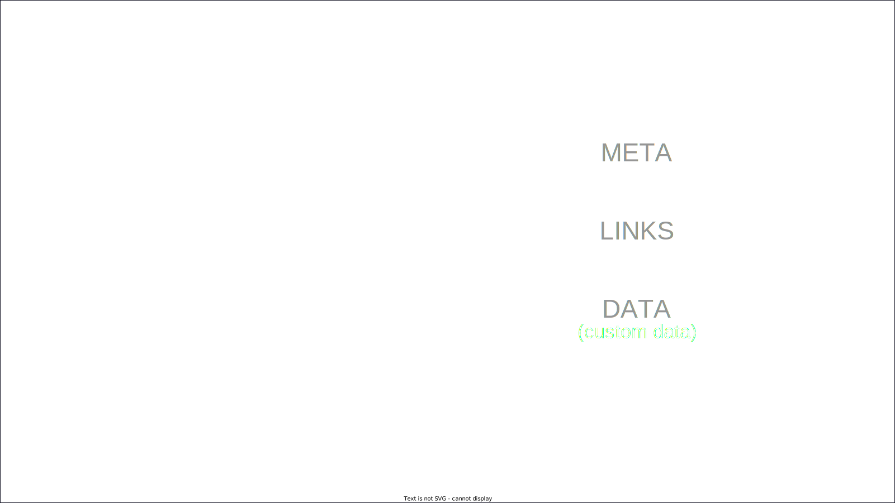

<!-- Uses MARP, see https://marp.app/ -->

<!--
class:
 - lead
 - invert
-->

# What is Eiffel?

#### And why should I care?

---
# The era of small-scale software is over

<!-- First, I would like to make a proclamation: The era of small-scale software is over.
It feels like wherever you look, on your phone, on your computer, in your home, at work and in society, most software is part of a much larger system.

The apps on your phone are often connected to the cloud. So are the applications on your computer. Maybe you have home-automation at home. Work can often be done just as easily outside the office as in the office. Your car might be connected 24/7 to receive updates and provide services. Government e-services are often connected together.

This doesn't mean that there is no small-scale software being developed, but I would say that most of what people are excited about is not stand-alone small-scale software. It is massive systems of connected parts. It is IoT + apps + cloud + AI + a lot of other stuff.

This puts a lot of weight on development processes and flows. For one, there are a lot of components that need to work together, but also there are a lot of different process that need to work together. Developing and releasing firmware for a hardware IoT device and building and deploying a performance tweak to a cloud service just ain't the same.

One thing that really helps is having a common language, and that is what we will be talking about today.
-->

---
# Eiffel Summit 2023.1

#### What is Eiffel and why should I care?

####

####

#### Erik Sternerson, doWhile / Volvo Cars

<!-- Notes
-->

---
<!--
_class:
 - invert
-->

# In this talk

* ## What is the purpose of Eiffel?
* ## What is Eiffel?
* ## Why should I care?

---
<!--
_backgroundColor: #766
-->

<!-- Let's first look into the purpose of Eiffel. 
-->

---
# A common language

<!-- Eiffel provides a common language both for technical systems and people. This common language allows both people and systems to ues the same words and concepts to refer to the same things. We will go into details a bit later, but first I want to talk about two benefits of having a common language.
-->

---
# Observability

<!-- The first benefit is observability. With complex software-centric systems there is often a need to have multiple tools and systems involved in the development flows, and having them all produce information in a common language makes it a lot easier to track, visualize and understand what is going in development, verification and release flows. Observability can help us answer several questions, including:
-->

---
<!--
_class:
 - invert
-->

# Observability answers:

* ## What have we built?
* ## What changes are included?
* ## How did we test the builds?
* ## What is its quality?
* ## **Are we ready to release?**

---
# Interoperability

<!-- The second benefit of a common language is interoperability, as in making different tools and systems work better together. Flows are all about making things happen, and having a commmon language makes it easier not only to see what just happened but also to start whatever actions should come next.
-->

---
<!--
_class:
 - invert
-->

# Interoperability provides:

* ## I know what just happened
* ## I know what it happened to
* ## I know what the outcome was
* ## I know where to find more information
* ## **I can decide the next action**

---
# What IS Eiffel?

## The Eiffel crash course :)

<!-- With this section I want to give you the best opportunity I can to help you participate in the rest of the Summit. So I am going to go into a little bit of details, but I will try to focus on the parts that may come up in later sessions.
-->

---
<!--
_class:
 - invert
-->

# Three aspects:

* ## An event specification
* ## A set of SDKs and tools
* ## A community

<!-- The community is what you see around you right now, plus a lot of people who couldn't be here today. The set of SDKs and tools will be covered by Mattias in the session after this, so I will focus on the first part: The event specification.
-->

---
# A defined set of events

<!-- 
-->

---
<!--
_class:
 - invert
-->
# Event categories:

<!-- 
-->

* ## Source Changes
* ## Packaging
* ## Verification
* ## Deployment
* ## Flows

---
<!--
_class:
 - invert
-->
# Event layout

<!-- 
-->

---
<!--
_class:
 - invert
-->
# Event layout

- ## Meta: About the event

<!-- 
-->

---
<!--
_class:
 - invert
-->
# Event layout meta

* ## Event type and version
* ## Identifier (UUID)
* ## Source
* ## Security

<!-- 
-->

---
<!--
_class:
 - invert
-->
# Event layout

- ## Meta: About the event
- ## Links: Related events

<!-- 
-->

---
# Links

<!-- ...
-->

---
# "Same type" / update links

<!-- ...
-->

---
# "Different type" / association links

<!-- ...
-->

---
<!--
_class:
 - invert
-->
# Event layout

- ## Meta: About the message
- ## Links: Related events
- ## Data: About the entity

<!-- 
-->

---
<!--
_class:
 - invert
-->
# Event data

* ## Specific to event type
* ## ActivityTriggered: Name of activity
* ## ActivityStarted: URL to live logs
* ## ActivityFinished: Outcome
* ## Data + Links = Complete picture

---
<!--
_class:
 - invert
-->
# Event layout

- ## Meta: About the message
- ## Links: Related events
- ## Data: About the entity
- ## Custom data: Your stuff!

<!-- 
-->

---
# JSON

<!-- ...
-->

---

<!-- ...
-->

---
# Why should I care?

<!-- ...
-->

---
# Because Eiffel is tried and tested

<!-- ...
-->

---
<!--
_class:
 - invert
-->

# Used for a long time, often, and in production:

* ## Started in Ericsson 2012 - 2.5M+ evs/day
* ## Open source since 2016 - Active community
* ## Driven by a technical committee (currently Axis and Ericsson)
* ## Part of the Continuous Delivery Landscape

---

<!-- ...
-->

---
# _What about CDEvents?_

<!-- ...
-->

---
<!--
_class:
 - invert
-->

# CDEvents for Eiffelers

* ## Started 2021 as part of CDF (LF)
* ## Lots of Eiffel involvement
* ## Broader scope, more actors involved
* ## Incubating, work in progress
* ## Translation service for Eiffel exists.

---
# _CDEvents session tomorrow 10.30_

<!-- ...
-->

---
# Because Eiffel has a large ecosystem of tools

<!-- ...
-->

---
# Because Eiffel continues to evolve

<!-- ...
-->

---
# Thank you!
# Q&A

<!-- ...
-->

